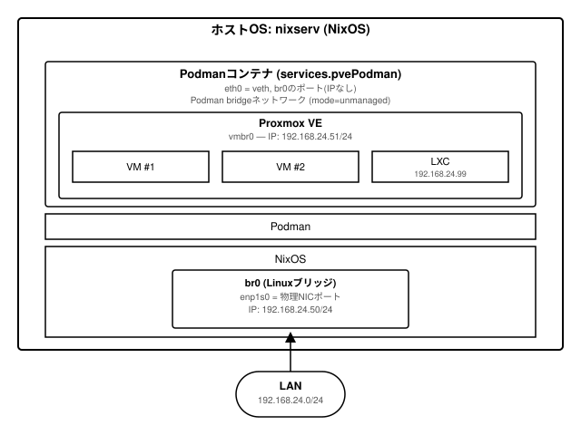

# NixOS-Server-config

NixOS + [numtide/blueprint](https://github.com/numtide/blueprint) によるサーバー `nixserv` の構成管理リポジトリ。

[PVE-podman](https://github.com/rkarsnk/PVE-podman) を使い、Podmanコンテナ上でProxmox VE(PVE)を稼働させています。

## 構成図

ホストOS・コンテナ・Proxmox VE・その先の仮想マシンがそれぞれ独立したLAN上のIPを持つ階層構成です
(NATを介さず、macvlanでLANに直接ぶら下がります)。



- **ホストOS(nixserv)**: `enp1s0` に固定IP `192.168.24.50/24` を割り当てたNixOS本体。
- **コンテナ(Podman)**: `enp1s0` を親インターフェースとしたmacvlanでLANに直結し、`192.168.24.51` を持つ。PVE本体はこのコンテナの中で動く。
- **Proxmox VE**: コンテナ内の `vmbr0` でさらにLANへブリッジし、その配下で動く各VMもLAN上に個別のIPを持てる。

## ディレクトリ構成

blueprintの規約により、`hosts/<ホスト名>/configuration.nix` が自動的に `nixosConfigurations.<ホスト名>` として公開されます。`flake.nix` 側での手動配線は不要です。

```
.
├── flake.nix                             # inputs 定義 + blueprint 呼び出しのみ
├── Makefile                              # nixos-rebuild のラッパー
└── hosts/
    └── nixserv/
        ├── configuration.nix             # imports のみのエントリーポイント
        ├── os/
        │   ├── hardware-configuration.nix  # nixos-generate-config によるハードウェア検出結果
        │   └── system.nix                  # ホストOS本体の設定(ブート・ネットワーク・ユーザー等)
        └── container/
            └── proxmox.nix                # Podman上でPVEを動かす services.pvePodman の設定
```

## flake inputs

| input | 用途 |
|---|---|
| `nixpkgs` | `nixos-26.05` チャンネル |
| `blueprint` | ディレクトリ構成から flake outputs を自動生成 |
| `pve-podman` | Podman上でProxmox VEを動かすNixOSモジュール |

## 使い方

```sh
make build   # nixos-rebuild build
make test    # nixos-rebuild test
make switch  # nixos-rebuild switch(本適用)
```

いずれも内部で `sudo nixos-rebuild <action> --flake .#nixserv` を実行します。
